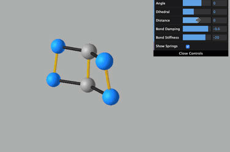
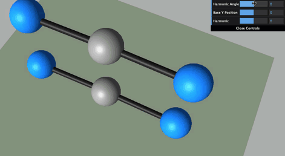

# DNA Viewer

A 3D DNA Viewer to explore potential uses for [threejs](https://threejs.org/), created for the Douglas Lab at UCSF.
Originally created in 2019. Updated dependencies and deployed to **Vercel** in 2022 [here](https://dna-viewer-git-jb-pendulumswing.vercel.app/). 
Also deployed to **Netlify** in 2024 [here](https://dna-viewer.netlify.app/).

Project template was derived from one of the threejs examples found [here](https://threejs.org/examples/#webgl_animation_keyframes)

